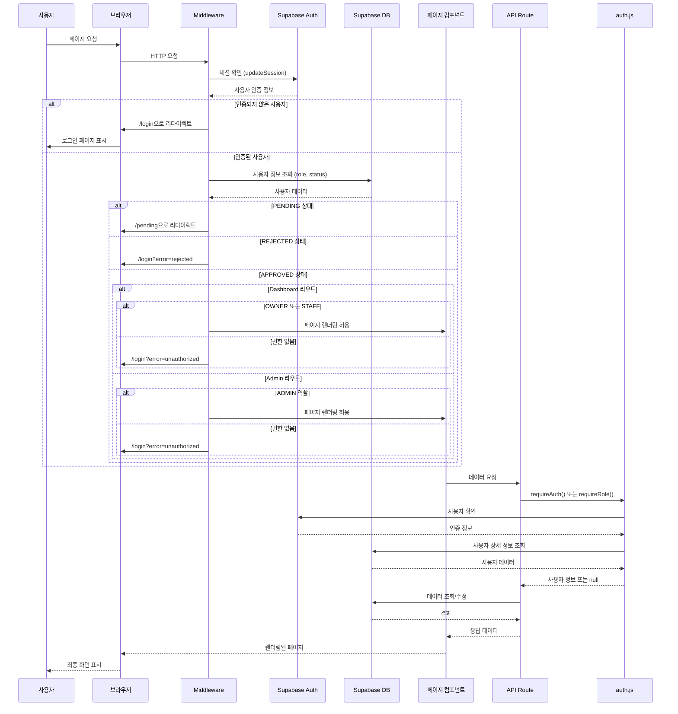
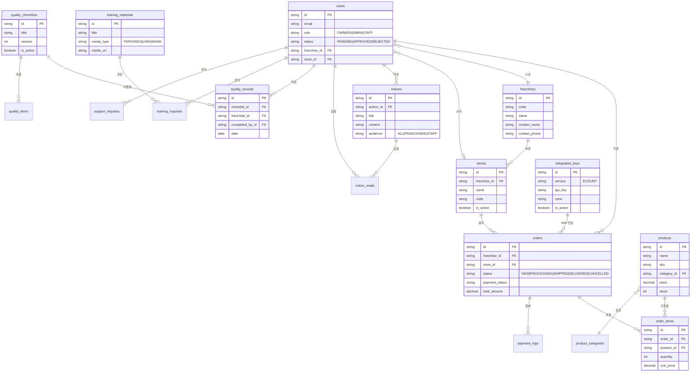
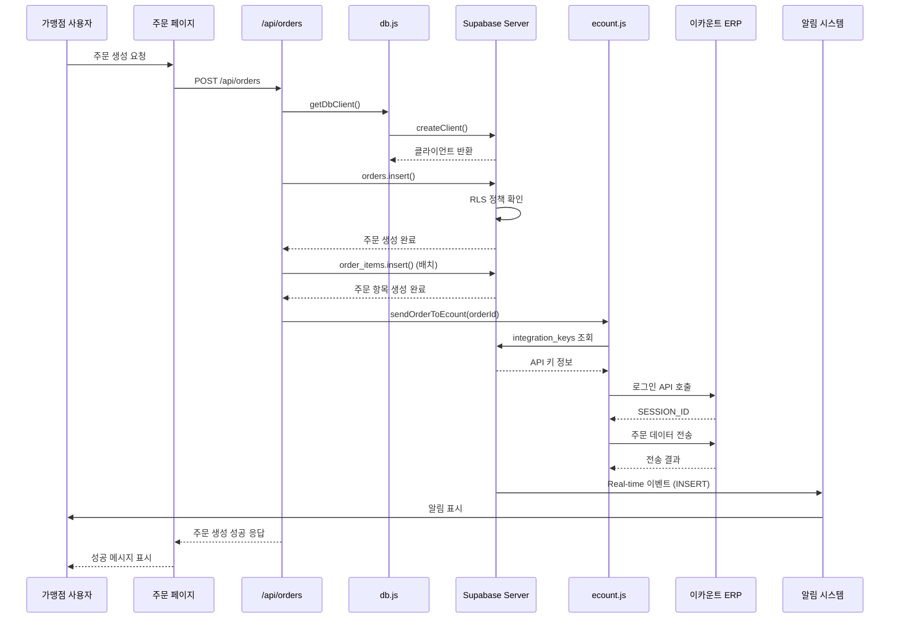

# 프로젝트 아키텍처 다이어그램

## 1. 시스템 아키텍처 개요

```mermaid
graph TB
    subgraph "클라이언트 (Browser)"
        UI[사용자 인터페이스]
        ClientComponents[클라이언트 컴포넌트]
    end

    subgraph "Next.js 애플리케이션"
        subgraph "라우팅 레이어"
            Middleware[Middleware<br/>인증/인가 처리]
            AppRouter[App Router<br/>페이지 라우팅]
        end

        subgraph "페이지 레이어"
            DashboardPages[(dashboard) 그룹<br/>가맹점/직원 페이지]
            AdminPages[(admin) 그룹<br/>관리자 페이지]
            PublicPages[공개 페이지<br/>로그인/회원가입]
        end

        subgraph "API 레이어"
            AuthAPI[인증 API<br/>/api/auth/*]
            OrdersAPI[주문 API<br/>/api/orders/*]
            ProductsAPI[제품 API<br/>/api/products/*]
            AdminAPI[관리자 API<br/>/api/admin/*]
            OtherAPI[기타 API<br/>공지/교육/품질 등]
        end

        subgraph "비즈니스 로직 레이어"
            AuthLib[lib/server/auth.js<br/>인증 헬퍼]
            DbLib[lib/server/db.js<br/>DB 접근 헬퍼]
            EcountLib[lib/integrations/ecount.js<br/>ERP 연동]
        end

        subgraph "데이터 접근 레이어"
            SupabaseClient[lib/supabase/client.js<br/>클라이언트 Supabase]
            SupabaseServer[lib/supabase/server.js<br/>서버 Supabase]
            SupabaseMiddleware[lib/supabase/middleware.js<br/>미들웨어 Supabase]
        end
    end

    subgraph "외부 서비스"
        SupabaseDB[(Supabase Database<br/>PostgreSQL)]
        SupabaseAuth[Supabase Auth<br/>인증 서비스]
        EcountERP[이카운트 ERP<br/>외부 API]
    end

    subgraph "컴포넌트 레이어"
        CommonComponents[공통 컴포넌트<br/>GlobalContactButton<br/>UserProfileDropdown]
        NotificationComponents[알림 컴포넌트<br/>NotificationProvider<br/>NotificationBell]
        TrainingComponents[교육 컴포넌트<br/>FileUpload<br/>MediaEmbed]
        UIComponents[UI 컴포넌트<br/>Button/Input/Label]
    end

    UI --> ClientComponents
    ClientComponents --> AppRouter
    AppRouter --> Middleware
    Middleware --> SupabaseMiddleware
    Middleware --> SupabaseAuth

    AppRouter --> DashboardPages
    AppRouter --> AdminPages
    AppRouter --> PublicPages

    DashboardPages --> CommonComponents
    AdminPages --> NotificationComponents
    DashboardPages --> TrainingComponents
    DashboardPages --> UIComponents
    AdminPages --> UIComponents

    DashboardPages --> AuthAPI
    AdminPages --> AdminAPI
    DashboardPages --> OrdersAPI
    DashboardPages --> ProductsAPI
    DashboardPages --> OtherAPI

    AuthAPI --> AuthLib
    OrdersAPI --> DbLib
    ProductsAPI --> DbLib
    AdminAPI --> DbLib
    OtherAPI --> DbLib

    AuthLib --> SupabaseServer
    DbLib --> SupabaseServer
    EcountLib --> SupabaseServer
    EcountLib --> EcountERP

    SupabaseClient --> SupabaseDB
    SupabaseServer --> SupabaseDB
    SupabaseServer --> SupabaseAuth
    SupabaseMiddleware --> SupabaseAuth

    style Middleware fill:#ffd700
    style SupabaseDB fill:#3ecf8e
    style SupabaseAuth fill:#3ecf8e
    style EcountERP fill:#ff6b6b
```

## 2. 컴포넌트 구조 및 의존성

```mermaid
graph LR
    subgraph "루트 레이아웃"
        RootLayout[app/layout.js<br/>전역 레이아웃]
        GlobalContact[GlobalContactButton<br/>공통 연락 버튼]
    end

    subgraph "대시보드 레이아웃"
        DashboardLayout[(dashboard)/layout.jsx<br/>가맹점/직원 레이아웃]
        UserProfile[UserProfileDropdown<br/>사용자 프로필]
    end

    subgraph "관리자 레이아웃"
        AdminLayout[admin/layout.jsx<br/>관리자 레이아웃]
        NotificationProvider[NotificationProvider<br/>알림 컨텍스트]
        NotificationBell[NotificationBell<br/>알림 벨]
        NotificationToaster[NotificationToaster<br/>알림 토스트]
    end

    subgraph "페이지 컴포넌트"
        DashboardPages[대시보드 페이지들<br/>주문/공지/품질/교육]
        AdminPages[관리자 페이지들<br/>주문관리/제품관리 등]
    end

    subgraph "교육 관련 컴포넌트"
        FileUpload[FileUpload<br/>파일 업로드]
        MediaEmbed[MediaEmbed<br/>미디어 임베드]
        InquiryPanel[InquiryPanel<br/>문의 패널]
    end

    subgraph "UI 컴포넌트"
        Button[Button<br/>버튼 컴포넌트]
        Input[Input<br/>입력 컴포넌트]
        Label[Label<br/>라벨 컴포넌트]
    end

    subgraph "유틸리티"
        Utils[lib/utils.js<br/>cn 함수]
    end

    RootLayout --> GlobalContact
    RootLayout --> DashboardLayout
    RootLayout --> AdminLayout

    DashboardLayout --> UserProfile
    DashboardLayout --> DashboardPages

    AdminLayout --> NotificationProvider
    AdminLayout --> NotificationBell
    AdminLayout --> UserProfile
    AdminLayout --> AdminPages

    NotificationProvider --> NotificationBell
    NotificationProvider --> NotificationToaster

    DashboardPages --> FileUpload
    DashboardPages --> MediaEmbed
    DashboardPages --> InquiryPanel
    DashboardPages --> Button
    DashboardPages --> Input
    DashboardPages --> Label

    AdminPages --> FileUpload
    AdminPages --> MediaEmbed
    AdminPages --> Button
    AdminPages --> Input
    AdminPages --> Label

    Button --> Utils
    Input --> Utils
    Label --> Utils

    style RootLayout fill:#4a90e2
    style DashboardLayout fill:#50c878
    style AdminLayout fill:#ff6b6b
    style NotificationProvider fill:#ffd700
```

## 3. 인증 및 권한 관리 흐름



## 4. 데이터베이스 스키마 관계도



## 5. API 라우트 구조

```mermaid
graph TD
    subgraph "인증 API"
        AuthLogin[/api/auth/login<br/>POST 로그인]
        AuthSignup[/api/auth/signup<br/>POST 회원가입]
        AuthLogout[/api/auth/logout<br/>POST 로그아웃]
    end

    subgraph "주문 API"
        OrdersList[/api/orders<br/>GET 목록, POST 생성]
        OrderDetail[/api/orders/[id]<br/>GET 조회, PUT 수정]
    end

    subgraph "제품 API"
        ProductsList[/api/products<br/>GET 목록, POST 생성]
        ProductDetail[/api/products/[id]<br/>GET 조회, PUT 수정]
        ProductOrderItems[/api/products/[id]/order-items<br/>GET 주문 내역]
        ProductCategories[/api/product-categories<br/>GET 카테고리 목록]
    end

    subgraph "공지사항 API"
        NoticesList[/api/notices<br/>GET 목록, POST 생성]
        NoticeDetail[/api/notices/[id]<br/>GET 조회, PUT 수정]
        NoticeRead[/api/notices/[id]/read<br/>POST 읽음 처리]
        NoticeReadStatus[/api/notices/read-status<br/>GET 읽음 상태]
    end

    subgraph "품질 관리 API"
        ChecklistsList[/api/quality/checklists<br/>GET 목록, POST 생성]
        ChecklistDetail[/api/quality/checklists/[id]<br/>GET 조회, PUT 수정]
        RecordsList[/api/quality/records<br/>GET 목록, POST 생성]
        RecordDetail[/api/quality/records/[id]<br/>GET 조회]
        MyRecords[/api/quality/records/my<br/>GET 내 기록]
    end

    subgraph "교육 API"
        TrainingMaterialsList[/api/training-materials<br/>GET 목록, POST 생성]
        TrainingMaterialDetail[/api/training-materials/[id]<br/>GET 조회, PUT 수정]
        TrainingMaterialUpload[/api/training-materials/upload<br/>POST 파일 업로드]
        TrainingInquiriesList[/api/training-inquiries<br/>GET 목록, POST 생성]
        TrainingInquiryDetail[/api/training-inquiries/[id]<br/>GET 조회, PUT 수정]
    end

    subgraph "사용자 관리 API"
        UsersList[/api/users<br/>GET 목록]
        UserDetail[/api/users/[id]<br/>GET 조회, PUT 수정]
        CreateAdmin[/api/admin/create-admin<br/>POST 관리자 생성]
    end

    subgraph "기타 API"
        FranchisesList[/api/franchises<br/>GET 목록]
        StoresList[/api/stores<br/>GET 목록]
        SupportInquiriesList[/api/support/inquiries<br/>GET 목록, POST 생성]
        SupportInquiryDetail[/api/support/inquiries/[id]<br/>GET 조회, PUT 수정]
        EcountKeysList[/api/integrations/ecount/keys<br/>GET 목록, POST 생성]
        EcountKeyDetail[/api/integrations/ecount/keys/[id]<br/>GET 조회, PUT 수정]
    end

    style AuthLogin fill:#4a90e2
    style OrdersList fill:#50c878
    style ProductsList fill:#50c878
    style NoticesList fill:#ffd700
    style ChecklistsList fill:#ff6b6b
    style TrainingMaterialsList fill:#9b59b6
```

## 6. 데이터 흐름도 (주문 생성 예시)



## 7. 파일 구조 트리

```mermaid
graph TD
    Root[init-nextjs-project/] --> Src[src/]
    Root --> Public[public/]
    Root --> SupabaseSQL[supabase/]
    Root --> Config[설정 파일들]

    Src --> App[app/]
    Src --> Components[components/]
    Src --> Lib[lib/]
    Src --> Types[types/]
    Src --> Constants[constants/]
    Src --> Data[data/]
    Src --> Middleware[middleware.ts]

    App --> DashboardGroup[(dashboard)/]
    App --> AdminGroup[(admin)/]
    App --> APIRoutes[api/]
    App --> PublicPages[공개 페이지들]
    App --> Layout[layout.js]
    App --> GlobalsCSS[globals.css]

    DashboardGroup --> DashboardPages[페이지들<br/>mypage/notices/products/quality/training]
    DashboardGroup --> DashboardLayout[layout.jsx]

    AdminGroup --> AdminPages[페이지들<br/>orders/products/notices/training/quality]
    AdminGroup --> AdminLayout[layout.jsx]

    APIRoutes --> AuthAPI[auth/]
    APIRoutes --> OrdersAPI[orders/]
    APIRoutes --> ProductsAPI[products/]
    APIRoutes --> AdminAPI[admin/]
    APIRoutes --> OtherAPI[기타 API들]

    Components --> Common[common/]
    Components --> Notifications[notifications/]
    Components --> Training[training/]
    Components --> UI[ui/]

    Lib --> Supabase[supabase/]
    Lib --> Server[server/]
    Lib --> Integrations[integrations/]
    Lib --> Utils[utils.js]

    Supabase --> Client[client.js]
    Supabase --> ServerFile[server.js]
    Supabase --> MiddlewareFile[middleware.js]

    Server --> Auth[auth.js]
    Server --> Db[db.js]

    Integrations --> Ecount[ecount.js]

    Types --> Domain[domain.ts]

    style Root fill:#4a90e2
    style App fill:#50c878
    style Components fill:#ffd700
    style Lib fill:#ff6b6b
    style APIRoutes fill:#9b59b6
```

## 8. 역할별 접근 권한 매트릭스

```mermaid
graph LR
    subgraph "사용자 역할"
        OWNER[OWNER<br/>가맹점주]
        STAFF[STAFF<br/>직원]
        ADMIN[ADMIN<br/>관리자]
    end

    subgraph "접근 가능한 라우트"
        DashboardRoutes[(dashboard) 그룹<br/>주문/공지/품질/교육]
        AdminRoutes[(admin) 그룹<br/>모든 관리 기능]
        PublicRoutes[공개 페이지<br/>로그인/회원가입]
    end

    subgraph "API 접근 권한"
        OwnerAPI[일반 API<br/>자신의 데이터만]
        AdminAPI[관리자 API<br/>모든 데이터]
    end

    OWNER -->|접근 가능| DashboardRoutes
    OWNER -->|접근 가능| PublicRoutes
    OWNER -->|제한적| OwnerAPI

    STAFF -->|접근 가능| DashboardRoutes
    STAFF -->|접근 가능| PublicRoutes
    STAFF -->|제한적| OwnerAPI

    ADMIN -->|접근 가능| AdminRoutes
    ADMIN -->|접근 가능| PublicRoutes
    ADMIN -->|전체| AdminAPI

    style OWNER fill:#50c878
    style STAFF fill:#4a90e2
    style ADMIN fill:#ff6b6b
    style DashboardRoutes fill:#ffd700
    style AdminRoutes fill:#ff6b6b
```

## 설명

### 주요 아키텍처 특징

1. **Next.js App Router 기반**: 최신 Next.js 16의 App Router를 사용하여 라우팅과 레이아웃을 관리합니다.

2. **Supabase 백엔드**: 
   - 인증: Supabase Auth를 통한 사용자 인증
   - 데이터베이스: PostgreSQL 기반의 Supabase Database
   - 실시간: Supabase Realtime을 통한 알림 시스템

3. **인증/인가 시스템**:
   - Middleware에서 모든 요청의 인증 상태 확인
   - 역할 기반 접근 제어 (RBAC): OWNER, STAFF, ADMIN
   - 상태 기반 접근 제어: PENDING, APPROVED, REJECTED

4. **라우트 그룹**:
   - `(dashboard)`: 가맹점주/직원용 페이지
   - `(admin)`: 관리자용 페이지

5. **외부 통합**:
   - 이카운트 ERP 연동을 통한 주문 자동 전송

6. **컴포넌트 구조**:
   - 공통 컴포넌트: 재사용 가능한 UI 컴포넌트
   - 도메인별 컴포넌트: 교육, 알림 등 특정 기능 컴포넌트

7. **타입 안정성**:
   - TypeScript 타입 정의를 통한 도메인 모델 관리

